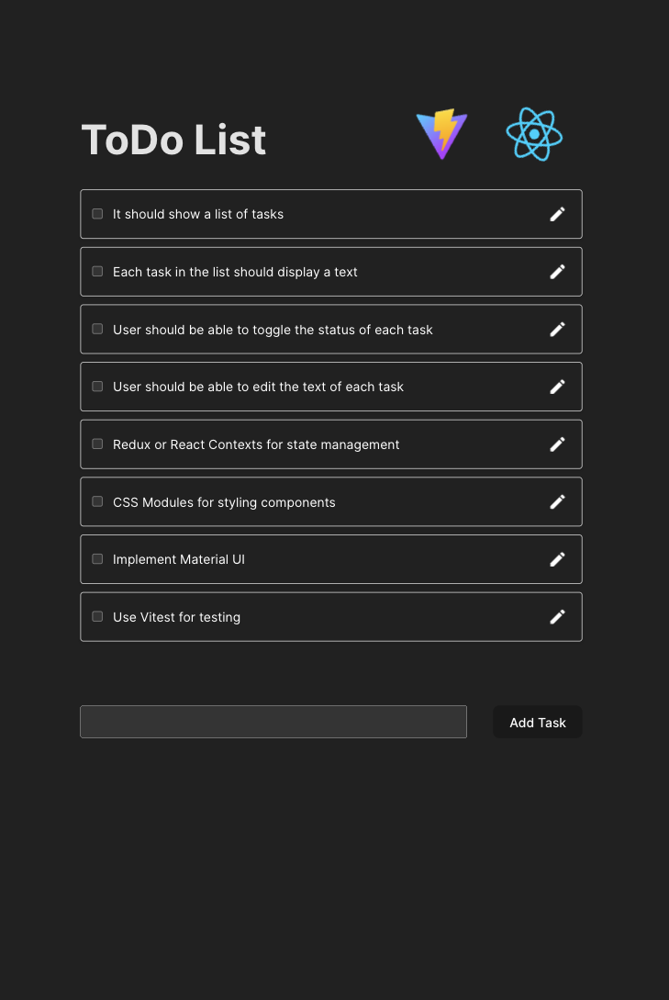

# TODO List

This is a Vite+React project built using the default template from the Vite website.

We will build the TODO list application together during the interview. Use of Copilot and similar tooling is not allowed.

The purpose of the exercise is to pair and code something within the time limit, not finding the most performant solution, or judging your code structure and naming conventions.

## What we will be building

A basic TODO list app with these basic requirements:

- It should show a list of tasks.
- Each task in the list should display a text (the actual task to do), and an status (pending or done).
- User should be able to toggle the status of each task.
- User should be able to edit the text of each task.

Not a requirement, but would be nice if we could use some of the tools in our current stack. For example:

- Redux or React Contexts for state management.
- CSS Modules for styling components.
- Maybe you have some experience with Material UI? we can add it during the interview.
- Vitest for testing.

### Run the app
```bash
$ npm install
$ npm run dev
````

### Missing installs
[Material UI docs](https://mui.com/material-ui/material-icons/?query=edit)

```bash
$ npm install @mui/icons-material @mui/material @emotion/styled @emotion/react
or 
$ npm install @mui/material @emotion/react @emotion/styled
$ npm install @mui/icons-material

$ npm install --save-dev vitest
$ npm install @testing-library/react @testing-library/jest-dom
$ npm install @testing-library/react @testing-library/user-event
$ npm install jsdom --save-dev
```


### Preview
